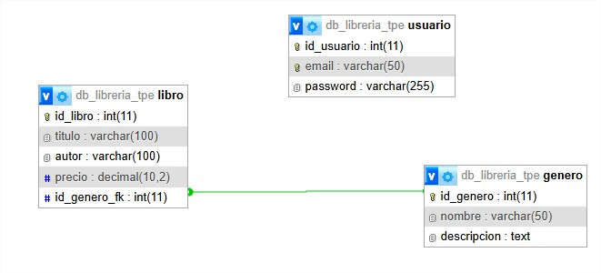

# Librería TPE

Sitio web de una librería con catálogo de libros y géneros. Permite la navegación pública del catálogo y la administración de datos mediante un panel protegido con login.

## Requisitos

- XAMPP (Apache + MySQL/MariaDB + PHP)
- Módulo `mod_rewrite` de Apache habilitado

## Instalación

1. Clonar o copiar el proyecto en `htdocs/libreria_tpe`.
2. Importar el archivo `db_libreria_tpe.sql` en phpMyAdmin para crear la base de datos con datos de ejemplo.
3. Verificar la configuración de la base de datos en `config.php` (host, nombre de la DB, usuario y contraseña).
4. Insertar manualmente el usuario administrador en la tabla `usuario` desde phpMyAdmin:

```sql
INSERT INTO usuario (email, password)
VALUES ('webadmin', '$2y$10$DdSfJj9Y1aRxcUJGMN.dee1R7RD7BJR7FGw3F3DOSNmmJe5mFvJbG');
```

> La contraseña hasheada corresponde a `admin`.

5. Acceder desde el navegador a `http://localhost/libreria_tpe/`.

## Usuario administrador

- **Usuario:** `webadmin`
- **Contraseña:** `admin`

## Rutas

### Públicas

| Ruta | Descripción |
|---|---|
| `/home` | Página principal |
| `/libros` | Listado de todos los libros |
| `/libros/ver/:id` | Detalle de un libro |
| `/generos` | Listado de géneros |
| `/generos/:id` | Libros filtrados por género |

### Autenticación

| Ruta | Descripción |
|---|---|
| `/login` | Formulario de login |
| `/logout` | Cerrar sesión |

### Administración (requiere login)

| Ruta | Descripción |
|---|---|
| `/admin/libros` | ABM de libros |
| `/admin/libros/agregar` | Agregar libro |
| `/admin/libros/editar/:id` | Editar libro |
| `/admin/libros/eliminar/:id` | Eliminar libro |
| `/admin/generos` | ABM de géneros |
| `/admin/generos/agregar` | Agregar género |
| `/admin/generos/editar/:id` | Editar género |
| `/admin/generos/eliminar/:id` | Eliminar género |

## Estructura del proyecto

```
libreria_tpe/
├── app/
│   ├── controllers/    # Controladores (Home, Books, Genres, Auth)
│   ├── models/         # Modelos + conexión a la DB
│   ├── views/          # Vistas (templates PHP)
│   └── middlewares/    # Session y Guard (protección de rutas admin)
├── assets/             # CSS
├── config.php          # Configuración de la base de datos
├── router.php          # Enrutador principal
├── .htaccess           # Rewrite de URLs
├── db_libreria_tpe.sql # Script SQL para crear la base de datos
└── DER.jpg             # Diagrama Entidad-Relación
```

## DER



## Tecnologías

- PHP 8
- MySQL / MariaDB
- HTML, CSS
- PDO (conexión a base de datos)
- MVC (Modelo-Vista-Controlador)
